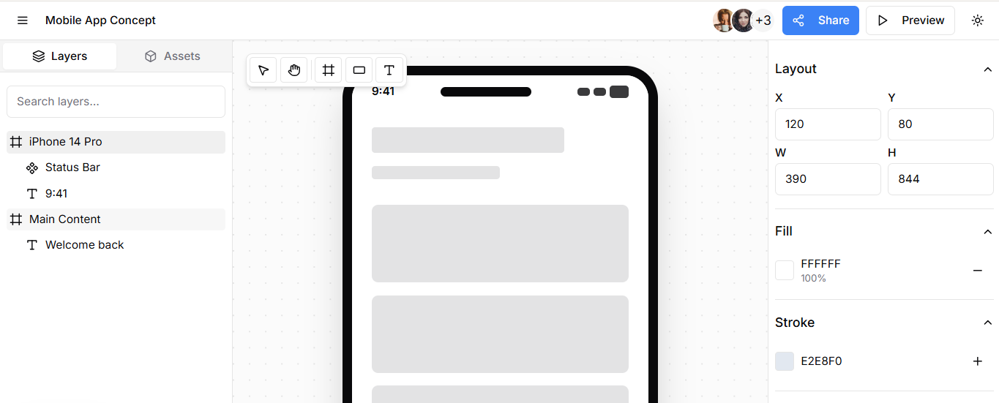

# Canvasly - Figma & Framer Combined

A powerful design and prototyping platform combining the best features of Figma and Framer.



## Features

### 🎨 Design Tools
- **Infinite Canvas**: Pan and zoom with mouse or trackpad
- **Drag & Drop**: Intuitive component placement
- **Real-time Collaboration**: Multi-user editing with live cursors
- **Responsive Design**: Preview on desktop, tablet, and mobile
- **Keyboard Shortcuts**: Figma-style shortcuts for power users

### 🧩 Components Library
- **Pre-built UI Elements**: Navigation, buttons, forms, cards
- **Custom Components**: Save and reuse your designs
- **Component Variants**: States like hover, active, disabled
- **Search & Filter**: Find components quickly

### 🚀 Export Options
- **Code Export**: HTML/CSS/React snippets
- **Figma Integration**: Copy to clipboard for Figma
- **Image Export**: PNG, JPG, SVG, PDF
- **Prototype Sharing**: Live preview links

### 👥 Collaboration
- **Real-time Editing**: Multiple users can work simultaneously
- **Comments**: Sticky notes and feedback
- **Version History**: Undo/redo and project versions
- **Team Management**: Invite and manage team members

## Tech Stack

- **Frontend**: Next.js 15, React 19, TypeScript
- **Styling**: Tailwind CSS
- **UI Components**: Heroicons
- **Canvas**: Fabric.js
- **State Management**: React Context API
- **Drag & Drop**: React DnD
- **Database**: Firebase Realtime Database
- **Authentication**: Firebase Auth
- **Collaboration**: WebSocket (planned)

## Getting Started

### Prerequisites
- Node.js 18+
- npm or yarn

### Installation

1. Clone the repository:
   ```bash
   git clone <repository-url>
   cd website-builder
   ```

2. Install dependencies:
   ```bash
   npm install
   ```

3. Set up Firebase:
   - Create a Firebase project at [Firebase Console](https://console.firebase.google.com/)
   - Enable Authentication (Email/Password, Google, GitHub)
   - Enable Realtime Database
   - Update the Firebase configuration in `src/app/lib/firebase.ts`

4. Run the development server:
   ```bash
   npm run dev
   ```

5. Open your browser to `http://localhost:3000`

## Project Structure

```
src/
├── app/                    # Next.js app directory
│   ├── api/               # API routes
│   ├── components/        # React components
│   │   ├── canvas/        # Canvas and drawing tools
│   │   ├── editor/        # Editor toolbar and panels
│   │   ├── properties/    # Properties panel
│   │   └── sidebar/       # Sidebar components
│   ├── context/           # React context providers
│   ├── hooks/             # Custom React hooks
│   ├── lib/               # Library files (Firebase config)
│   ├── services/          # Business logic services
│   ├── types/             # TypeScript types
│   ├── utils/             # Utility functions
│   ├── auth/              # Authentication pages
│   ├── dashboard/         # Dashboard pages
│   ├── profile/           # Profile settings
│   ├── projects/          # Projects management
│   ├── teams/             # Team collaboration
│   └── trash/             # Deleted projects
├── public/                # Static assets
└── styles/                # Global styles
```

## Development

### Available Scripts

- `npm run dev` - Start development server
- `npm run build` - Build for production
- `npm run start` - Start production server
- `npm run lint` - Run ESLint
- `npm run test` - Run tests (when implemented)

### Environment Variables

Create a `.env.local` file in the root directory:

```env
NEXT_PUBLIC_FIREBASE_API_KEY=your_firebase_api_key
NEXT_PUBLIC_FIREBASE_AUTH_DOMAIN=your_firebase_auth_domain
NEXT_PUBLIC_FIREBASE_DATABASE_URL=your_firebase_database_url
NEXT_PUBLIC_FIREBASE_PROJECT_ID=your_firebase_project_id
```

## Deployment

The application can be deployed to any platform that supports Next.js, such as:

1. **Vercel** (recommended):
   - Connect your GitHub repository
   - Set environment variables
   - Deploy with one click

2. **Netlify**:
   - Set build command to `next build`
   - Set publish directory to `.next/dist/`

3. **AWS Amplify**:
   - Connect your repository
   - Set build settings
   - Deploy

## Usage Guide

### Creating Your First Project

1. Visit `/auth` to sign up or log in
2. Click "New Project" on the dashboard
3. Drag components from the sidebar to the canvas
4. Customize elements using the Properties panel
5. Switch to Preview mode to see your design
6. Export your work when finished

### Collaboration Features

1. Invite team members from the Teams page
2. Share project links for viewing or editing
3. Leave comments on specific elements
4. See live cursors of other collaborators

### Keyboard Shortcuts

- **V**: Move tool
- **H**: Hand tool (pan)
- **R**: Rectangle tool
- **T**: Text tool
- **F**: Frame tool
- **Ctrl+C/V**: Copy/paste
- **Ctrl+Z**: Undo
- **Ctrl+Shift+Z**: Redo
- **Space+Drag**: Pan canvas
- **Ctrl+Plus/Minus**: Zoom in/out

## Contributing

1. Fork the repository
2. Create a feature branch (`git checkout -b feature/AmazingFeature`)
3. Commit your changes (`git commit -m 'Add some AmazingFeature'`)
4. Push to the branch (`git push origin feature/AmazingFeature`)
5. Open a pull request

## License

This project is licensed under the MIT License - see the [LICENSE](LICENSE) file for details.

## Support

- **Documentation**: [GUIDE.md](GUIDE.md)
- **Issues**: [GitHub Issues](https://github.com/yourusername/website-builder/issues)
- **Email**: support@websitebuilder.com

## Acknowledgments

- Inspired by [Figma](https://figma.com) and [Framer](https://framer.com)
- Built with [Next.js](https://nextjs.org)
- UI components from [Heroicons](https://heroicons.com)
- Canvas powered by [Fabric.js](http://fabricjs.com)
- Authentication and database by [Firebase](https://firebase.google.com)

---

*This is a work in progress. Features are being added regularly. Check back for updates!*
